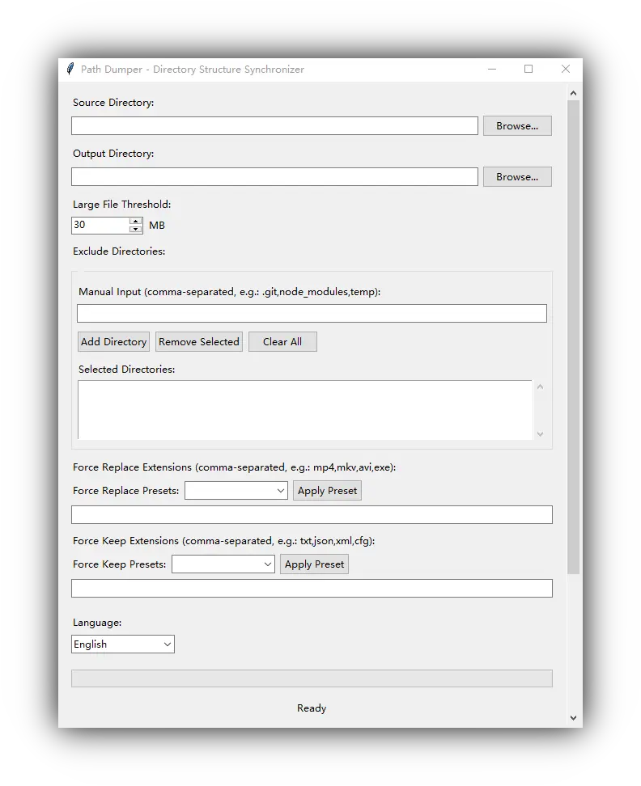

# Windows 目录结构归档工具

[English](README.md) | [简体中文](README.zh_Hans.md) | [繁體中文](README.zh_Hant.md)

一个用于同步 Windows 目录结构的工具, 支持将大文件替换为占位符, 完美适用于媒体库备份等场景.

## ✨ 功能特点

- **📄 非破坏性**: 保留完整目录结构, 将大文件替换为占位符文件;
- **🎯 智能过滤**: 支持按文件大小、扩展名和目录排除规则进行智能过滤;
- **⚡ 高效同步**: 直接目录同步, 快速处理大型文件集合;
- **🔧 灵活配置**: 支持强制替换/保留特定扩展名文件;
- **💻 免安装**: Portable 运行, 无需安装, 没有额外依赖;
- **🌐 多语言支持**: 支持英语、简体中文、繁体中文;

## 🎮 使用方法

直接从 [Releases](https://github.com/fernvenue/path-dumper-windows/releases/latest) 下载最新版本运行即可, 无需安装.



1. **选择源目录**: 点击浏览按钮选择要同步的源目录;
2. **选择输出目录**: 选择同步后文件的输出位置;
3. **设置大文件阈值**: 超过此大小的文件将被替换为占位符（默认 30MB）;
4. **配置排除规则**: 可选择排除特定目录（如 .git、node_modules 等）;
5. **设置扩展名规则**: 可强制替换或保留特定扩展名的文件;
6. **开始同步**: 点击"开始同步"按钮执行操作;

## 🚀 自行构建

需要预先安装 Python 环境.

克隆仓库:

```bash
git clone https://github.com/fernvenue/path-dumper-windows.git
cd path-dumper-windows
```

运行构建脚本:

```bash
build.bat
```

## 许可证

本工具以 GPLv3 协议开源, 详情请参考 [LICENSE](./LICENSE).
