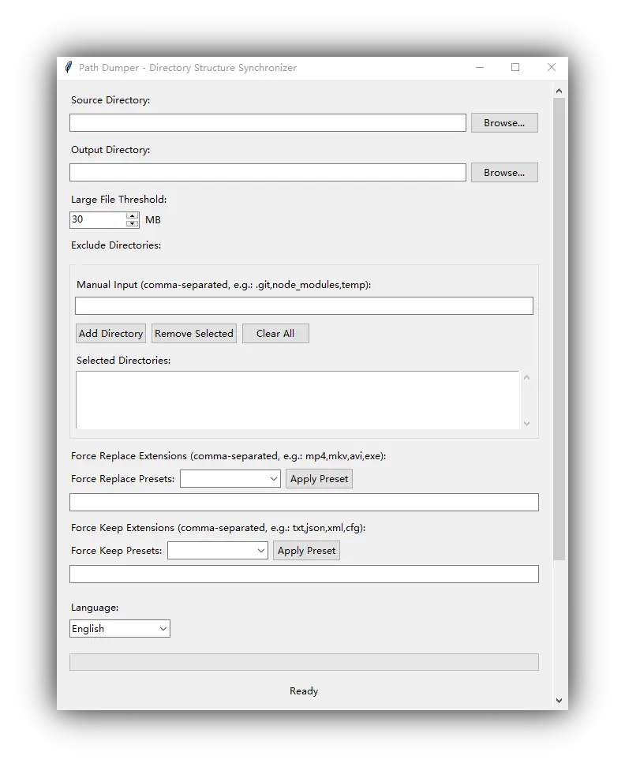

# Windows 目錄結構同步工具

[English](README.md) | [简体中文](README.zh_Hans.md) | [繁體中文](README.zh_Hant.md)

一個用於同步 Windows 目錄結構的工具, 支援將大檔案替換為佔位符, 完美適用於媒體庫備份等場景.

## ✨ 功能特點

- **📄 非破壞性**: 保留完整目錄結構, 將大檔案替換為佔位符檔案；
- **🎯 智慧過濾**: 支援按檔案大小、副檔名和目錄排除規則進行智慧過濾；
- **⚡ 高效同步**: 直接目錄同步, 快速處理大型檔案集合；
- **🔧 靈活配置**: 支援強制替換/保留特定副檔名檔案；
- **💻 免安裝**: Portable 執行, 無需安裝, 沒有額外依賴；
- **🌐 多語言支援**: 支援英語、簡體中文、繁體中文；

## 🎮 使用方法

直接從 [Releases](https://github.com/fernvenue/path-dumper-windows/releases/latest) 下載最新版本執行即可, 無需安裝.



1. **選擇來源目錄**: 點擊瀏覽按鈕選擇要同步的來源目錄；
2. **選擇輸出目錄**: 選擇同步後檔案的輸出位置；
3. **設定大檔案閾值**: 超過此大小的檔案將被替換為佔位符（預設 30MB）；
4. **配置排除規則**: 可選擇排除特定目錄（如 .git、node_modules 等）；
5. **設定副檔名規則**: 可強制替換或保留特定副檔名的檔案；
6. **開始同步**: 點擊「開始同步」按鈕執行操作；

## 🚀 自行建置

需要預先安裝 Python 環境.

複製儲存庫: 

```bash
git clone https://github.com/fernvenue/path-dumper-windows.git
cd path-dumper-windows
```

執行建置腳本: 

```bash
build.bat
```

## 授權條款

本工具以 GPLv3 協議開源, 詳情請參考 [LICENSE](./LICENSE).
